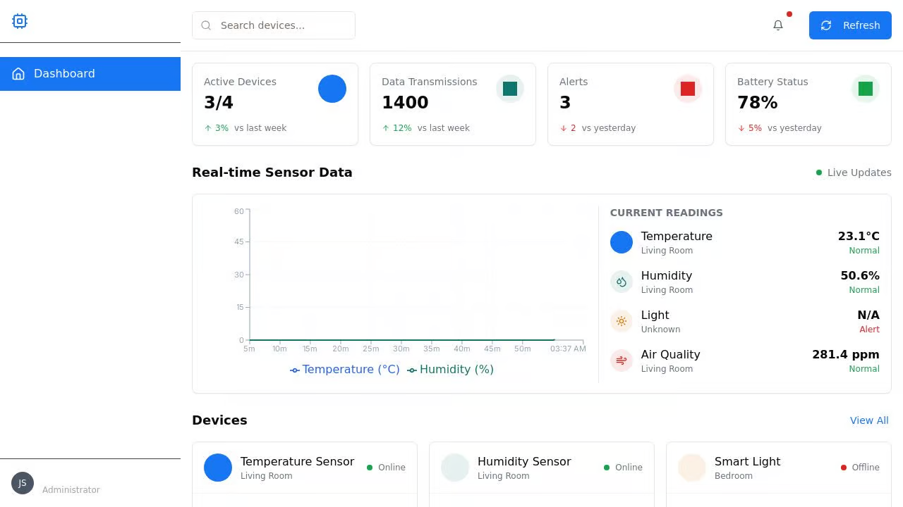

# IoT Web Dashboard

A modern web application for monitoring and controlling IoT devices with real-time data visualization.



## Features

- **Real-time device monitoring**: View device statuses, readings, and alerts in real-time
- **Interactive dashboard**: Monitor key metrics including active devices, data transmissions, alerts, and battery status
- **Device management**: View device details, toggle settings, and reconnect offline devices
- **Activity logs**: Track system events and device alerts
- **Responsive design**: Works on desktop, tablet, and mobile devices

## Technologies Used

- **Frontend**: React, TypeScript, Tailwind CSS, shadcn/ui
- **Backend**: Express.js
- **Real-time communication**: WebSockets
- **Data visualization**: Recharts
- **State management**: React Context API
- **Routing**: wouter

## Getting Started

### Prerequisites

- Node.js 18+ and npm

### Installation

1. Clone the repository
2. Install dependencies:
   ```
   npm install
   ```
3. Start the development server:
   ```
   npm run dev
   ```
4. Open your browser to `http://localhost:5000`

## Project Structure

- `/client` - Frontend React application
  - `/src/components` - UI components
  - `/src/contexts` - React contexts for state management
  - `/src/hooks` - Custom React hooks
  - `/src/pages` - Application pages
- `/server` - Express.js backend
  - `/routes.ts` - API endpoints and WebSocket server
  - `/storage.ts` - Data storage implementation
- `/shared` - Shared types and schemas

## API Endpoints

- `GET /api/devices` - Get all devices
- `GET /api/activities` - Get recent activities
- `GET /api/stats` - Get dashboard statistics
- `PATCH /api/devices/:id` - Update device settings
- WebSocket at `/ws` for real-time updates

## Future Enhancements

- User authentication and authorization
- Device grouping and filtering
- Advanced analytics and reporting
- Mobile application
- Integration with popular IoT platforms

## License

[MIT](LICENSE)